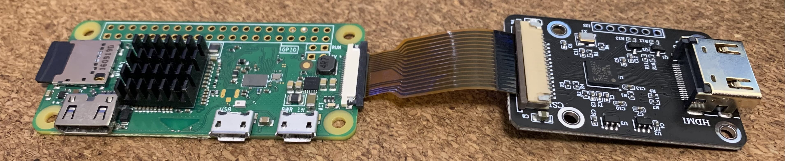
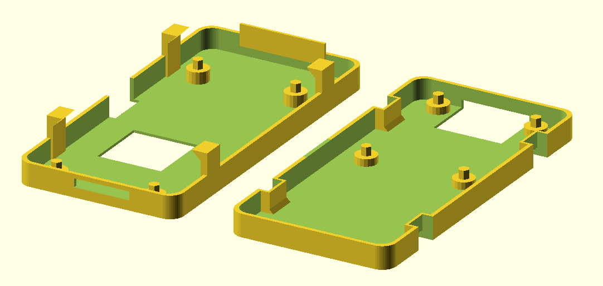

# openscad-pikvm-case

This repository contains the [OpenSCAD] source and the resulting STL file for a [PiKVM] case to hold a Raspberry Pi Zero W (or a Zero 2W) together with an [HDMI-to-CSI bridge][alx].

The resulting assembly snaps inside the case halves, with the HDMI and heatsink protruding. This isn't meant to sit neatly on a shelf, but to hang off the back of the PC with <10cm cables, taking up as little room as possible.

## Caveats

* Tolerances for the snap fits were tuned for `PETG` printed with a 0.4mm nozzle at 0.2mm layer height, so your mileage may vary (see the `catch_*` modules).
* This was designed to use a Pi Zero W _despite support for that being deprecated in 2022_ because it only requires the one USB-OTG cable for control and power, and I don't really need all the additional functionality of newer [PiKVM] models (I can't even get enough Ethernet ports near the PCs I'm controlling, and think that the [PiKVM] project dropping support for the Zero W was a mistake).
* It assumes you're using one of the ultra-short CSI cables that ship with some Pi Zero kits.

> **Warning**
> 
> If you use _anything else_ than the original Zero W (like a Zero 2W) and open another cutout for the second USB port, make sure you **do not** plug both USB ports into your computer without removing one of the `5V/GND` pairs to avoid current loops.

[OpenSCAD]: https://openscad.org/
[PiKVM]: https://pikvm.org/
[alx]: https://www.aliexpress.com/item/4000102166176.html